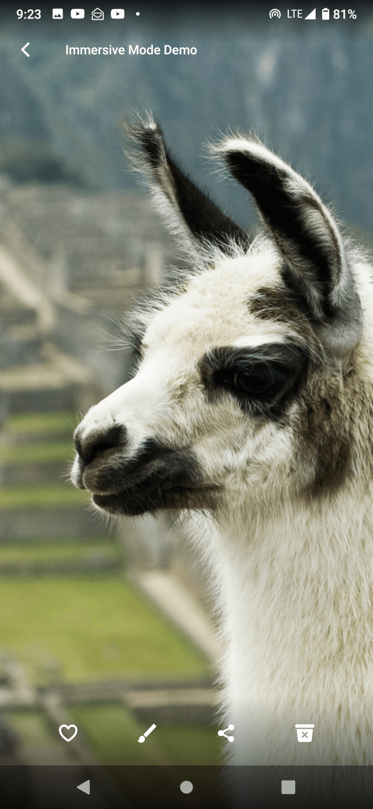

# Android-Immerse-Demo

A modern way to implement Android immersive fullscreen activity that can be used as base activity for a variety of applications, such as galleries, video players, etc.

 

## Features

- Lollipop 5.0 (API 21) and up.
- Support display cutouts.
- Hiding/showing UI on tap.
- Handling screen rotation.
- Handling **multi-window** (split screen) mode.

## Solved Challenges

### Display Cutouts

[A strange artifact in full screen on some devices](https://stackoverflow.com/questions/63924072/android-a-strange-artifact-in-full-screen-on-some-devices) solved with the help of [Javad Dehban](https://stackoverflow.com/a/63924328/13776879).

### Getting navigation bar height

This code below worked great except some fancy devices such as Motorola Moto G8 where it gives wrong value (199 instead of 126) in the second measurement.

```java
Point appUsableSize = getAppUsableScreenSize(context);
Point realScreenSize = getRealScreenSize(context);
int navigationBarHeight = 0;

// navigation bar at the bottom
if (appUsableSize.y < realScreenSize.y) {
    navigationBarHeight = realScreenSize.y - appUsableSize.y;
}
```

Solved with this method:

```java
        // navigation bar at the bottom
        if (appUsableSize.y < realScreenSize.y) {
            Resources resources = context.getResources();
            int resourceId = resources.getIdentifier("navigation_bar_height", "dimen", "android");
            if (resourceId > 0) {
                navigationBarHeight = resources.getDimensionPixelSize(resourceId);
            }
        }
```

### Hiding UI on Tap

- `onUserInteraction` is called every time user switches between apps, so this method does not suit this purpose.
- Simple `onClick` breaks swipe from the screen edges gesture.

Solved with `OnSwipeTouchListener` class.

### Erroneous orientation report in multi-window mode

In multi-window mode, Android erroneously reports orientation as ORIENTATION_LANDSCAPE when indeed,
phone's orientation is PORTRAIT but window `width` > `height`. When the app is in multi window,
the Activity is not tied to the full display dimensions. This redefines the concept of Activity orientation.

Solved with https://stackoverflow.com/a/41401863/13776879

## Credits

- Photo **Llama on Machu Picchu** By Alexandre Buisse (Nattfodd) - Own work (http://www.alexandrebuisse.org), CC BY-SA 3.0, https://commons.wikimedia.org/w/index.php?curid=2841095
- Icons by [Ben Sperry](https://github.com/ionic-team/ionicons), MIT, https://github.com/ionic-team/ionicons/blob/master/LICENSE

## License

The project is licensed under the [MIT](LICENSE).